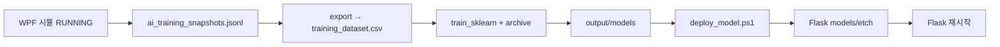

# AI 학습 모델 — 경로·시뮬 수집·재학습

WPF **시뮬만** 돌려도 기본 sklearn 모델을 만들 수 있습니다. TwinCAT·Flask 없이도 JSONL 수집 → 학습까지 가능하고, 배포 시 Flask를 재시작하면 ML 추론이 켜집니다.

---

## 1. 데이터 수집 (WPF 시뮬)

| 항목 | 내용 |
|------|------|
| **기록 주기** | 1초 (`MaybeRecordAiTrainingSnapshot`) |
| **조건** | 앱 실행 중 UI 타이머 동작 (시뮬 허용·RUNNING 권장) |
| **원본 파일** | `{실행폴더}/data/ai_training_snapshots.jsonl` |

### 일반적인 절대 경로 (Visual Studio F5)

```
d:\WPFProject\etch_ui\bin\Debug\net8.0-windows\data\ai_training_snapshots.jsonl
```

Release 빌드:

```
d:\WPFProject\etch_ui\bin\Release\net8.0-windows\data\ai_training_snapshots.jsonl
```

### 수집 절차 (권장 5분 이상)

1. WPF 실행 → 로그인 (`admin` / `Admin1234`)
2. **「시뮬 허용」** ON (TwinCAT 없이 동작)
3. **공정 Start** (또는 **「데모 진행」** 후 수동 Start 유지)
4. **5분 이상** RUNNING 유지 → 약 **300행** 이상 (최소 학습 기본값 **80행**)
5. (선택) 인터락 이탈·알람 상태를 일부러 만들면 `alarm_class` 라벨이 풍부해짐

> JSONL은 Git에 넣지 않아도 됩니다. 로컬 `data/` 아래에만 쌓입니다.

---

## 2. 변환·학습 (etch_ui repo)

| 단계 | 스크립트 | 출력 |
|------|----------|------|
| JSONL → CSV | `tools/ai/export_training_dataset.py` | `tools/ai/output/training_dataset.csv` |
| 학습 | `tools/ai/train_sklearn.py` | `tools/ai/output/models/*.joblib`, `manifest.json` |
| **원클릭** | `tools/ai/train_from_sim.ps1` | 위 전체 + CSV 아카이브 |

### 한 번에 (시뮬 데이터 → 학습 → Flask 배포)

```powershell
cd d:\WPFProject\etch_ui
pip install scikit-learn joblib numpy

# WPF 시뮬 5분+ 수집 후:
.\tools\ai\train_from_sim.ps1 -Deploy -Archive
```

- `-Archive`: 이전 `output/models/*.joblib` 및 Flask 배포본을 타임스탬프 폴더에 백업
- `-MinRows 120`: 최소 행 수 조정 (기본 80)
- `-Jsonl "D:\...\ai_training_snapshots.jsonl"`: 경로 직접 지정

### 단계별

```powershell
python tools/ai/export_training_dataset.py --min-rows 80
python tools/ai/train_sklearn.py --archive
.\tools\ai\deploy_model.ps1 -ArchiveFlask
```

### 합성 데이터만 (시뮬 없이 CI·초기 스텁 대체)

```powershell
python tools/ai/generate_synthetic_dataset.py -n 3000
python tools/ai/train_sklearn.py
```

---

## 3. 디렉터리 맵 (저장·재학습)

```
etch_ui/
├── bin/Debug/net8.0-windows/data/
│   └── ai_training_snapshots.jsonl     ← WPF 원본 (시뮬 1Hz)
│
└── tools/ai/
    ├── export_training_dataset.py
    ├── train_sklearn.py
    ├── train_from_sim.ps1               ← 시뮬 파이프라인 진입점
    ├── deploy_model.ps1
    ├── alarm_labels.py                  ← CSV용 alarm_class 도출
    │
    └── output/
        ├── training_dataset.csv         ← 최신 학습용 CSV (덮어쓰기)
        ├── models/
        │   ├── anomaly_classifier.joblib   ← 현재 학습 결과 (배포 소스)
        │   ├── alarm_classifier.joblib
        │   ├── manifest.json
        │   ├── archive/                    ← --archive 시 이전 joblib 백업
        │   │   └── 20260604-153000/
        │   └── flask_deploy_archive/       ← -ArchiveFlask 시 Flask 이전본
        │
        └── datasets/archive/
            └── training_dataset_20260604-153000.csv   ← 재학습마다 CSV 스냅샷
```

### Flask 런타임 (추론)

```
C:\etchflask\models\etch\
├── anomaly_classifier.joblib
├── alarm_classifier.joblib
└── manifest.json
```

Flask 재시작 후:

- `GET http://localhost:5000/api/etch/ai/status` → `ready: true`, `engine: sklearn`
- WPF AI 패널: **(ML)** (`stub: false`)

---

## 4. 재학습 워크플로



1. **새 JSONL**이 쌓일 때까지 시뮬을 다시 돌린다 (또는 기존 JSONL을 이어서 append).
2. `train_from_sim.ps1 -Archive` 로 이전 joblib·CSV를 아카이브한 뒤 학습.
3. `-Deploy -Archive` 로 Flask 쪽도 백업 후 복사.
4. `manifest.json`의 `trained_at`, `rows`, `metrics`로 버전 비교.

라벨 `alarm_class`는 JSONL의 `alarmCode`가 없어도 **압력·진동·상태**로 학습용 클래스를 채웁니다 (실제 Flask 스텁 규칙과 같은 계열). 현장 알람 코드가 JSONL에 있으면 그 값이 우선합니다.

---

## 5. 요구 사항·문제 해결

| 증상 | 조치 |
|------|------|
| `JSONL 없음` | WPF 실행·시뮬 허용·Start 후 5분+ |
| `Need at least 80 rows` | RUNNING 시간 연장 또는 `-MinRows` 낮춤 (비권장) |
| Flask `ready: false` | `deploy_model.ps1`, `pip install joblib scikit-learn`, 재시작 |
| AI 패널 `(규칙 스텁)` | models/etch 없음 또는 추론 폴백 |

---

## 6. 관련 문서

- `tools/ai/README.md` — 스크립트 요약
- `C:\etchflask\ETCH_AI.md` — API·Flask ML
- `PROJECT_모듈상태_AI_계획.md` — Phase 4 로드맵

*마지막 갱신: 시뮬 JSONL 파이프라인·경로 가이드 추가 시 PR/커밋에서 날짜 갱신.*
